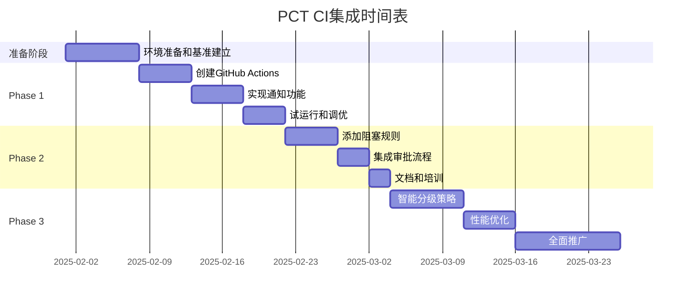

# Pure Component CI集成实施计划

## 1. 概述

本文档描述如何将Pure Component检测集成到现有的CI/CD流程中，采用GitHub Actions作为主要实施方案，实现零侵入性的自动化质量检测。

## 2. 核心原则

- **零侵入性**：不修改现有CI配置，通过新增独立workflow实现
- **渐进式推进**：从通知开始，逐步提升到阻塞
- **开发友好**：提供清晰的报告和修复指导
- **性能优先**：不显著增加CI时间

## 3. 实施阶段

### Phase 0: 准备工作（第1周）

#### 3.1 确定检测范围
```yaml
# 需要检测的组件目录
component_paths:
  - src/common/components/**/*.{jsx,tsx}
  - src/features/**/components/**/*.{jsx,tsx}
  
# 排除的文件
exclude:
  - **/*.test.{jsx,tsx}
  - **/*.stories.{jsx,tsx}
  - **/demo/**
```

#### 3.2 建立基准
```bash
# 在master/develop分支建立组件基准
npm run pct:baseline -- \
  --branch develop \
  --output ./pct-baseline \
  --components src/common/components
```

### Phase 1: 通知模式（第2-3周）

#### 3.1 创建GitHub Actions Workflow

```yaml
# .github/workflows/pure-component-check.yml
name: Pure Component Check

on:
  pull_request:
    types: [opened, synchronize]
    paths:
      - 'src/**/components/**/*.jsx'
      - 'src/**/components/**/*.tsx'
      - 'src/**/components/**/*.scss'
      - 'src/**/components/**/*.css'

jobs:
  component-analysis:
    name: Analyze Components
    runs-on: ubuntu-latest
    # 初期设置为非阻塞
    continue-on-error: true
    
    steps:
      - name: Checkout PR Branch
        uses: actions/checkout@v4
        with:
          fetch-depth: 0
          
      - name: Setup Environment
        uses: actions/setup-node@v4
        with:
          node-version: '18'
          cache: 'npm'
          
      - name: Install PCT Tool
        run: |
          # 从MDT项目安装PCT工具
          npm install -g @mdt/pct-cli
          # 或者使用npx直接运行
          
      - name: Detect Changed Components
        id: detect
        run: |
          # 获取变更的组件列表
          CHANGED_COMPONENTS=$(pct detect \
            --base origin/${{ github.base_ref }} \
            --head ${{ github.sha }} \
            --format json)
            
          echo "components=$CHANGED_COMPONENTS" >> $GITHUB_OUTPUT
          
      - name: Run Component Analysis
        id: analyze
        run: |
          pct analyze \
            --base origin/${{ github.base_ref }} \
            --head ${{ github.sha }} \
            --components '${{ steps.detect.outputs.components }}' \
            --output ./pct-report
            
          # 设置输出变量
          if [ -f "./pct-report/has-breaking-changes" ]; then
            echo "has_breaking_changes=true" >> $GITHUB_OUTPUT
          else
            echo "has_breaking_changes=false" >> $GITHUB_OUTPUT
          fi
          
      - name: Generate Visual Report
        if: steps.analyze.outputs.has_breaking_changes == 'true'
        run: |
          pct report \
            --input ./pct-report \
            --format html \
            --output ./pct-report/visual-report.html
            
      - name: Upload Reports
        uses: actions/upload-artifact@v4
        with:
          name: pct-analysis-report
          path: |
            pct-report/
            
      - name: Comment on PR
        uses: actions/github-script@v7
        with:
          script: |
            const fs = require('fs');
            const reportPath = './pct-report/summary.json';
            
            if (!fs.existsSync(reportPath)) {
              console.log('No component changes detected');
              return;
            }
            
            const report = JSON.parse(fs.readFileSync(reportPath, 'utf8'));
            
            let comment = '## 🔍 Pure Component Analysis Report\n\n';
            comment += `**Branch:** \`${{ github.head_ref }}\` → \`${{ github.base_ref }}\`\n`;
            comment += `**Analyzed at:** ${new Date().toISOString()}\n\n`;
            
            // 变更摘要
            comment += '### 📊 Summary\n\n';
            comment += `- Total components analyzed: ${report.totalComponents}\n`;
            comment += `- Components with changes: ${report.changedComponents}\n`;
            comment += `- Breaking changes: ${report.breakingChanges.length}\n`;
            comment += `- New components: ${report.newComponents.length}\n\n`;
            
            // 破坏性变更
            if (report.breakingChanges.length > 0) {
              comment += '### ⚠️ Breaking Changes\n\n';
              comment += '> The following components have breaking changes that may affect existing usage:\n\n';
              
              report.breakingChanges.forEach(change => {
                comment += `#### 🔸 \`${change.component}\`\n`;
                comment += `- **Change Type:** ${change.type}\n`;
                comment += `- **Description:** ${change.description}\n`;
                comment += `- **Affected Props:** ${change.affectedProps.join(', ')}\n`;
                comment += `- **Visual Diff:** [View Comparison](${change.visualDiffUrl})\n\n`;
                
                // 显示具体例子
                if (change.examples && change.examples.length > 0) {
                  comment += '<details>\n';
                  comment += '<summary>Examples of affected usage</summary>\n\n';
                  comment += '```jsx\n';
                  comment += change.examples[0].code;
                  comment += '\n```\n';
                  comment += '</details>\n\n';
                }
              });
              
              comment += '> 💡 **To approve these changes:** Add `[pct-approved]` to your PR description\n\n';
            }
            
            // 新组件
            if (report.newComponents.length > 0) {
              comment += '### ✨ New Components\n\n';
              report.newComponents.forEach(comp => {
                comment += `- \`${comp.name}\` (${comp.path})\n`;
              });
              comment += '\n> 📝 Remember to add tests for new components\n\n';
            }
            
            // 报告链接
            comment += '### 📋 Full Report\n\n';
            comment += `🔗 [View Detailed Analysis](https://github.com/${{ github.repository }}/actions/runs/${{ github.run_id }})\n`;
            
            // 查找并更新现有评论
            const { data: comments } = await github.rest.issues.listComments({
              owner: context.repo.owner,
              repo: context.repo.repo,
              issue_number: context.issue.number
            });
            
            const botComment = comments.find(comment => 
              comment.user.type === 'Bot' && 
              comment.body.includes('Pure Component Analysis Report')
            );
            
            if (botComment) {
              await github.rest.issues.updateComment({
                owner: context.repo.owner,
                repo: context.repo.repo,
                comment_id: botComment.id,
                body: comment
              });
            } else {
              await github.rest.issues.createComment({
                owner: context.repo.owner,
                repo: context.repo.repo,
                issue_number: context.issue.number,
                body: comment
              });
            }
```

#### 3.2 配置通知级别

```yaml
# .github/pct-config.yml
notification:
  # Phase 1: 只通知不阻塞
  mode: "notify-only"
  
  # 通知规则
  rules:
    - component: "src/common/components/Button/**"
      level: "warning"
      notify: ["@frontend-team"]
      
    - component: "src/common/components/**"
      level: "info"
      
    - component: "src/features/**/components/**"
      level: "info"
```

### Phase 2: 可选阻塞模式（第4-5周）

#### 更新workflow支持阻塞

```yaml
      - name: Evaluate Blocking Rules
        id: evaluate
        run: |
          # 读取配置
          CONFIG=$(cat .github/pct-config.yml)
          MODE=$(echo "$CONFIG" | yq '.notification.mode')
          
          # 检查是否应该阻塞
          if [[ "$MODE" == "blocking-with-approval" ]] && \
             [[ "${{ steps.analyze.outputs.has_breaking_changes }}" == "true" ]]; then
            
            # 检查是否已批准
            if [[ "${{ github.event.pull_request.body }}" == *"[pct-approved]"* ]]; then
              echo "Changes approved"
              echo "should_block=false" >> $GITHUB_OUTPUT
            else
              echo "Breaking changes need approval"
              echo "should_block=true" >> $GITHUB_OUTPUT
            fi
          else
            echo "should_block=false" >> $GITHUB_OUTPUT
          fi
          
      - name: Set Check Status
        uses: actions/github-script@v7
        with:
          script: |
            const shouldBlock = '${{ steps.evaluate.outputs.should_block }}' === 'true';
            const hasBreakingChanges = '${{ steps.analyze.outputs.has_breaking_changes }}' === 'true';
            
            let conclusion = 'success';
            let title = '✅ Component Check Passed';
            let summary = 'No breaking changes detected.';
            
            if (shouldBlock) {
              conclusion = 'failure';
              title = '❌ Component Check Failed';
              summary = 'Breaking changes detected and need approval. Add [pct-approved] to PR description.';
            } else if (hasBreakingChanges) {
              conclusion = 'success';
              title = '⚠️ Component Check Passed (with warnings)';
              summary = 'Breaking changes detected but approved.';
            }
            
            await github.rest.checks.create({
              owner: context.repo.owner,
              repo: context.repo.repo,
              name: 'Pure Component Analysis',
              head_sha: context.sha,
              status: 'completed',
              conclusion: conclusion,
              output: {
                title: title,
                summary: summary
              }
            });
```

### Phase 3: 智能阻塞模式（第6-8周）

#### 3.1 基于组件重要性的分级策略

```yaml
# .github/pct-config.yml
notification:
  mode: "smart-blocking"
  
components:
  # 核心组件 - 破坏性变更必须审批
  critical:
    - path: "src/common/components/Button/**"
      breaking_change_policy: "block"
      required_approvers: ["@tech-lead", "@qa-lead"]
      
    - path: "src/common/components/Form/**"
      breaking_change_policy: "block"
      required_approvers: ["@frontend-team"]
      
  # 普通组件 - 破坏性变更警告
  normal:
    - path: "src/features/**/components/**"
      breaking_change_policy: "warn"
      
  # 实验性组件 - 不检查
  experimental:
    - path: "src/experimental/**"
      breaking_change_policy: "skip"
```

#### 3.2 集成CODEOWNERS

```bash
# .github/CODEOWNERS
# Pure Component 相关变更需要额外审批
/src/common/components/Button/ @frontend-lead @qa-lead
/src/common/components/Form/ @frontend-lead
/src/common/components/ @frontend-team
```

## 4. 监控和优化

### 4.1 性能监控

```yaml
      - name: Performance Metrics
        if: always()
        run: |
          END_TIME=$(date +%s)
          DURATION=$((END_TIME - ${{ steps.start.outputs.time }}))
          
          # 上报到监控系统
          curl -X POST $METRICS_ENDPOINT \
            -d '{
              "metric": "pct.analysis.duration",
              "value": '$DURATION',
              "tags": {
                "branch": "${{ github.head_ref }}",
                "status": "${{ job.status }}"
              }
            }'
```

### 4.2 准确率追踪

```javascript
// 收集反馈数据
const feedback = {
  component: 'Button',
  detectedAsBreaking: true,
  actuallyBreaking: false, // 用户反馈
  falsePositiveReason: 'Color change was intentional brand update'
};

// 用于优化检测算法
await pctApi.reportFeedback(feedback);
```

## 5. 开发者体验优化

### 5.1 本地预检查

```json
// package.json
{
  "scripts": {
    "pre-push": "pct check --local",
    "pct:check": "pct analyze --base develop --format cli"
  },
  "husky": {
    "hooks": {
      "pre-push": "npm run pre-push"
    }
  }
}
```

### 5.2 IDE集成

```bash
# VS Code 扩展
code --install-extension mdt.pure-component-analyzer

# 功能：
# - 实时显示组件使用情况
# - 修改时预警破坏性变更
# - 一键运行本地检查
```

## 6. 回滚计划

如果需要快速禁用PCT检查：

### 6.1 临时禁用
```yaml
# 在PR中添加标签
labels:
  - skip-pct-check
```

### 6.2 紧急回滚
```bash
# 删除workflow文件
git rm .github/workflows/pure-component-check.yml
git commit -m "Temporarily disable PCT check"
git push
```

### 6.3 部分禁用
```yaml
# 修改配置为仅通知模式
notification:
  mode: "notify-only"  # 从 "blocking" 改为 "notify-only"
```

## 7. 成功指标

### 7.1 短期指标（1个月）
- CI集成完成率：100%
- 检测准确率：> 90%
- 误报率：< 10%
- CI时间增加：< 30秒

### 7.2 长期指标（3个月）
- 组件破坏性变更减少：60%
- 组件相关bug减少：50%
- 开发者满意度：> 80%
- 平均修复时间减少：40%

## 8. 实施时间表



## 9. 常见问题

### Q: 为什么选择GitHub Actions而不是其他CI？
A: GitHub Actions提供最佳的零侵入性集成，不需要修改现有CI配置，且与PR流程紧密集成。

### Q: 如何处理误报？
A: 
1. 使用 `[pct-approved]` 标记批准
2. 提交反馈改进算法
3. 配置组件特定规则

### Q: 对CI性能影响如何？
A: 
- 增量分析：只检查变更的组件
- 并行执行：利用GitHub Actions的并发能力
- 智能缓存：缓存分析结果
- 目标：< 30秒额外时间

### Q: 如何逐步推广到全团队？
A: 
1. 先在小团队试点
2. 收集反馈并优化
3. 制作培训材料
4. 逐个项目推广