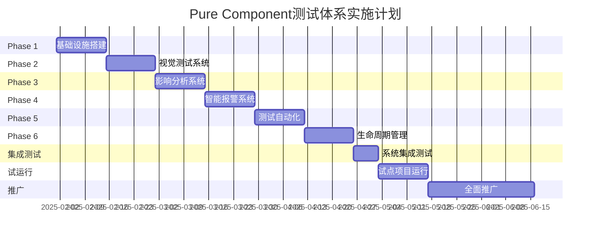

# Pure Component 完整生命周期测试体系实施计划

## 1. 执行摘要

本计划旨在构建一个智能化的Pure Component全生命周期测试体系，通过自动化检测、影响分析、智能报警等手段，确保组件修改的可控性和系统的稳定性。该体系将覆盖组件从创建、使用、演化到废弃的完整生命周期。

## 2. 核心目标

### 2.1 主要目标
- **提高组件修改的可见性**：让开发者清楚了解每次修改的影响范围
- **降低回归风险**：通过自动化测试和影响分析，减少非预期的破坏
- **优化开发效率**：通过智能化工具减少手动测试和确认的工作量
- **建立质量基准**：为每个组件建立性能、视觉、行为的基准线

### 2.2 成功指标
- 组件修改导致的生产事故减少80%
- 组件测试覆盖率达到90%以上
- 开发者对组件修改影响的认知度提升到95%
- 组件回归测试时间减少70%

## 3. 技术架构设计

### 3.1 系统架构图
```
┌─────────────────────────────────────────────────────────────────┐
│                     Pure Component Testing System                │
├─────────────────────────────────────────────────────────────────┤
│                                                                 │
│  ┌──────────────┐  ┌──────────────┐  ┌──────────────┐         │
│  │   Detection  │  │   Analysis   │  │  Reporting   │         │
│  │    Engine    │  │    Engine    │  │   Engine     │         │
│  └──────┬───────┘  └──────┬───────┘  └──────┬───────┘         │
│         │                  │                  │                 │
│  ┌──────┴────────────────┴──────────────────┴───────┐         │
│  │              Core Processing Layer                 │         │
│  ├───────────────────────────────────────────────────┤         │
│  │  • AST Parser    • Diff Analyzer   • ML Model     │         │
│  │  • Visual Comparator • Impact Calculator          │         │
│  └───────────────────────────────────────────────────┘         │
│                                                                 │
│  ┌───────────────────────────────────────────────────┐         │
│  │                  Data Storage Layer                │         │
│  ├───────────────────────────────────────────────────┤         │
│  │  • Component Registry  • Snapshot Store            │         │
│  │  • Usage Database     • Test Results              │         │
│  └───────────────────────────────────────────────────┘         │
└─────────────────────────────────────────────────────────────────┘
```

### 3.2 核心模块设计

#### 3.2.1 检测引擎 (Detection Engine)
```typescript
interface DetectionEngine {
  // 组件发现
  discoverComponents(): ComponentInfo[]
  
  // 变更检测
  detectChanges(component: string): ChangeSet
  
  // 使用追踪
  trackUsage(component: string): UsageInfo[]
  
  // 依赖分析
  analyzeDependencies(component: string): DependencyGraph
}
```

#### 3.2.2 分析引擎 (Analysis Engine)
```typescript
interface AnalysisEngine {
  // 影响评估
  assessImpact(changes: ChangeSet): ImpactReport
  
  // 风险评分
  calculateRisk(impact: ImpactReport): RiskScore
  
  // 测试建议
  suggestTests(component: string, changes: ChangeSet): TestSuggestion[]
  
  // 性能分析
  analyzePerformance(component: string): PerformanceMetrics
}
```

#### 3.2.3 报告引擎 (Reporting Engine)
```typescript
interface ReportingEngine {
  // 生成报告
  generateReport(analysis: AnalysisResult): Report
  
  // 发送通知
  sendAlerts(report: Report): void
  
  // 仪表板更新
  updateDashboard(metrics: ComponentMetrics): void
  
  // 历史追踪
  trackHistory(component: string, event: LifecycleEvent): void
}
```

## 4. 实施阶段

### Phase 1: 基础设施搭建 (第1-2周)

#### 目标
建立核心检测和分析能力

#### 具体任务
1. **AST解析器开发**
   - 实现React/Vue组件的AST解析
   - 提取组件props、state、方法等信息
   - 识别Pure Component特征

2. **组件注册系统**
   - 建立组件元数据存储
   - 实现组件版本管理
   - 创建组件依赖图

3. **基础检测能力**
   - 文件变更监控
   - Git集成（commit hook）
   - 初步的变更分析

#### 交付物
- 可运行的组件检测服务
- 组件注册数据库
- 基础API接口

### Phase 2: 视觉测试系统 (第3-4周)

#### 目标
建立组件视觉快照和对比能力

#### 具体任务
1. **快照生成系统**
   ```javascript
   // 自动生成所有props组合的快照
   generateSnapshots(component) {
     const propsCombinations = generatePropsCombinations(component)
     return propsCombinations.map(props => ({
       props,
       snapshot: renderAndCapture(component, props),
       metadata: extractMetadata(component, props)
     }))
   }
   ```

2. **视觉对比引擎**
   - 像素级对比
   - 结构对比
   - 样式对比

3. **智能差异识别**
   - 区分有意义的变化和噪音
   - 标注关键变更区域
   - 生成变更热力图

#### 交付物
- 视觉快照服务
- 对比分析报告
- 变更可视化界面

### Phase 3: 影响分析系统 (第5-6周)

#### 目标
实现智能的影响预测和风险评估

#### 具体任务
1. **使用场景映射**
   ```typescript
   interface UsageScenario {
     location: string          // 使用位置
     businessContext: string   // 业务场景
     criticality: number      // 关键程度 0-10
     props: PropsUsage        // 实际使用的props
     testCoverage: number     // 测试覆盖率
   }
   ```

2. **影响预测模型**
   - 基于历史数据训练
   - 考虑组件复杂度
   - 评估连锁反应

3. **风险评分算法**
   ```javascript
   calculateRisk(change, usage) {
     const factors = {
       breakingChange: detectBreakingChanges(change),
       criticalUsage: usage.filter(u => u.criticality > 7),
       testCoverage: calculateAverageTestCoverage(usage),
       historicalIssues: getHistoricalIssues(component)
     }
     
     return weightedScore(factors)
   }
   ```

#### 交付物
- 影响分析API
- 风险评估报告
- 决策支持界面

### Phase 4: 智能报警系统 (第7-8周)

#### 目标
建立分级报警和通知机制

#### 具体任务
1. **报警规则引擎**
   ```yaml
   rules:
     - name: "Critical Component Change"
       condition: 
         - component.criticality > 8
         - change.type == "breaking"
       action: 
         - block_commit: true
         - notify: ["tech-lead", "qa-team"]
         - require_review: 2
     
     - name: "Visual Regression"
       condition:
         - visual_diff > 10%
         - affected_pages > 5
       action:
         - warning: true
         - generate_report: true
         - notify: ["component-owner"]
   ```

2. **通知集成**
   - Slack/钉钉集成
   - 邮件通知
   - PR评论自动化

3. **仪表板开发**
   - 实时监控面板
   - 组件健康度展示
   - 趋势分析图表

#### 交付物
- 报警规则配置系统
- 多渠道通知服务
- 监控仪表板

### Phase 5: 测试自动化 (第9-10周)

#### 目标
实现测试的自动生成和更新

#### 具体任务
1. **智能测试生成**
   ```javascript
   generateTests(component, usage) {
     const tests = []
     
     // 基础功能测试
     tests.push(...generateFunctionalTests(component))
     
     // 基于使用场景的测试
     usage.forEach(scenario => {
       tests.push(generateScenarioTest(scenario))
     })
     
     // 边缘案例测试
     tests.push(...generateEdgeCaseTests(component))
     
     // 性能测试
     if (component.criticality > 6) {
       tests.push(...generatePerformanceTests(component))
     }
     
     return optimizeTestSuite(tests)
   }
   ```

2. **测试迁移系统**
   - 自动更新受影响的测试
   - 标记过时的测试
   - 建议新的测试场景

3. **测试优化器**
   - 去重复测试
   - 优先级排序
   - 并行执行优化

#### 交付物
- 自动测试生成服务
- 测试迁移工具
- 测试执行优化器

### Phase 6: 生命周期管理 (第11-12周)

#### 目标
完善组件全生命周期管理

#### 具体任务
1. **组件生命周期追踪**
   ```typescript
   class ComponentLifecycle {
     // 诞生
     onCreate(component: ComponentInfo) {
       this.registry.register(component)
       this.analyzer.generateBaseline(component)
       this.testGenerator.createInitialTests(component)
     }
     
     // 成长
     onUsageExpand(component: string, newUsage: UsageInfo) {
       this.usage.track(component, newUsage)
       this.testGenerator.expandTests(component, newUsage)
       this.monitor.updateMetrics(component)
     }
     
     // 演化
     onChange(component: string, changes: ChangeSet) {
       const impact = this.analyzer.assessImpact(changes)
       const decision = await this.getDecision(impact)
       this.applyChanges(component, changes, decision)
     }
     
     // 消亡
     onDeprecate(component: string) {
       const migration = this.planner.createMigrationPlan(component)
       this.notifier.informUsers(component, migration)
       this.archiver.preserve(component)
     }
   }
   ```

2. **版本管理系统**
   - 组件版本控制
   - 向后兼容性检查
   - 渐进式迁移支持

3. **知识库建设**
   - 最佳实践文档
   - 常见问题解决方案
   - 组件使用指南

#### 交付物
- 完整生命周期管理系统
- 版本控制服务
- 知识库平台

## 5. 技术实现细节

### 5.1 组件识别算法
```javascript
function identifyPureComponent(ast) {
  const indicators = {
    // 无副作用
    noSideEffects: !hasUseEffect(ast) && !hasComponentDidMount(ast),
    
    // 依赖props
    propsDependent: analyzePropsDependency(ast) > 0.8,
    
    // 无内部状态或状态简单
    simpleState: countStateVariables(ast) <= 2,
    
    // 渲染确定性
    deterministicRender: !hasRandomOrDate(ast),
    
    // 无外部依赖
    noExternalDeps: !hasGlobalVariableAccess(ast)
  }
  
  const score = calculatePurityScore(indicators)
  return score > 0.85
}
```

### 5.2 影响范围计算
```javascript
function calculateImpactScope(component, change) {
  // 直接影响
  const directImpact = findDirectUsages(component)
  
  // 间接影响（通过组合组件）
  const indirectImpact = findIndirectUsages(component)
  
  // 样式继承影响
  const styleImpact = analyzeStyleInheritance(component, change)
  
  // 数据流影响
  const dataFlowImpact = analyzeDataFlow(component, change)
  
  return {
    total: directImpact.length + indirectImpact.length,
    critical: filterCritical([...directImpact, ...indirectImpact]),
    byType: categorizeImpact(directImpact, indirectImpact),
    visualization: generateImpactGraph(component, directImpact, indirectImpact)
  }
}
```

### 5.3 智能测试生成策略
```javascript
class TestGenerationStrategy {
  generateForComponent(component) {
    const strategies = []
    
    // 1. Props组合策略
    if (component.props.length > 3) {
      strategies.push(new PairwiseTestingStrategy())
    } else {
      strategies.push(new ExhaustiveTestingStrategy())
    }
    
    // 2. 状态转换策略
    if (component.hasState) {
      strategies.push(new StateTransitionTestingStrategy())
    }
    
    // 3. 边界值策略
    strategies.push(new BoundaryValueTestingStrategy())
    
    // 4. 业务场景策略
    const scenarios = extractBusinessScenarios(component)
    strategies.push(new ScenarioTestingStrategy(scenarios))
    
    return combineStrategies(strategies)
  }
}
```

## 6. 实施时间线



## 7. 风险评估与缓解策略

### 7.1 技术风险
| 风险 | 可能性 | 影响 | 缓解策略 |
|------|--------|------|----------|
| AST解析复杂度高 | 高 | 高 | 使用成熟的解析库，逐步支持更多语法 |
| 性能问题 | 中 | 高 | 实现增量分析，使用缓存机制 |
| 误报率高 | 中 | 中 | 建立反馈机制，持续优化算法 |
| 集成困难 | 低 | 高 | 提供多种集成方式，渐进式推广 |

### 7.2 组织风险
| 风险 | 可能性 | 影响 | 缓解策略 |
|------|--------|------|----------|
| 开发者抵触 | 中 | 高 | 强调工具的辅助性质，提供培训 |
| 流程改变阻力 | 高 | 中 | 逐步推进，从非关键项目开始 |
| 资源投入不足 | 中 | 高 | 分阶段实施，展示早期成果 |

## 8. 成功标准

### 8.1 短期成功标准（3个月）
- 完成核心功能开发
- 在2-3个项目中试点运行
- 组件修改导致的问题减少50%
- 开发者满意度达到80%

### 8.2 长期成功标准（6个月）
- 系统稳定运行，可用性>99%
- 覆盖所有前端项目
- 组件质量指标提升30%
- 成为标准开发流程的一部分

## 9. 资源需求

### 9.1 人力资源
- 前端架构师：1人（全职）
- 高级前端工程师：3人（全职）
- 测试工程师：2人（全职）
- UI/UX设计师：1人（兼职）
- 项目经理：1人（兼职）

### 9.2 技术资源
- 服务器：4台（2台应用服务器，1台数据库服务器，1台存储服务器）
- CI/CD环境：Jenkins/GitLab CI
- 监控工具：Grafana + Prometheus
- 存储：最少500GB用于快照存储

## 10. 下一步行动

1. **立即行动**（第1周）
   - 组建项目团队
   - 搭建开发环境
   - 开始Phase 1开发

2. **短期计划**（第1个月）
   - 完成Phase 1-2
   - 选定试点项目
   - 收集早期反馈

3. **中期目标**（第3个月）
   - 完成所有Phase开发
   - 在试点项目中验证效果
   - 准备全面推广计划

## 附录A：技术选型建议

- **AST解析**：@babel/parser, @typescript-eslint/parser
- **视觉测试**：Playwright, Percy, BackstopJS
- **数据存储**：PostgreSQL + Redis
- **消息队列**：RabbitMQ/Kafka
- **前端框架**：React + TypeScript
- **API框架**：NestJS/Express
- **监控工具**：Sentry, DataDog

## 附录B：参考资料

1. [Facebook的Jest Snapshot Testing](https://jestjs.io/docs/snapshot-testing)
2. [Google的Lighthouse性能测试](https://github.com/GoogleChrome/lighthouse)
3. [Storybook的Visual Testing](https://storybook.js.org/docs/react/writing-tests/visual-testing)
4. [Chromatic的UI Testing](https://www.chromatic.com/)